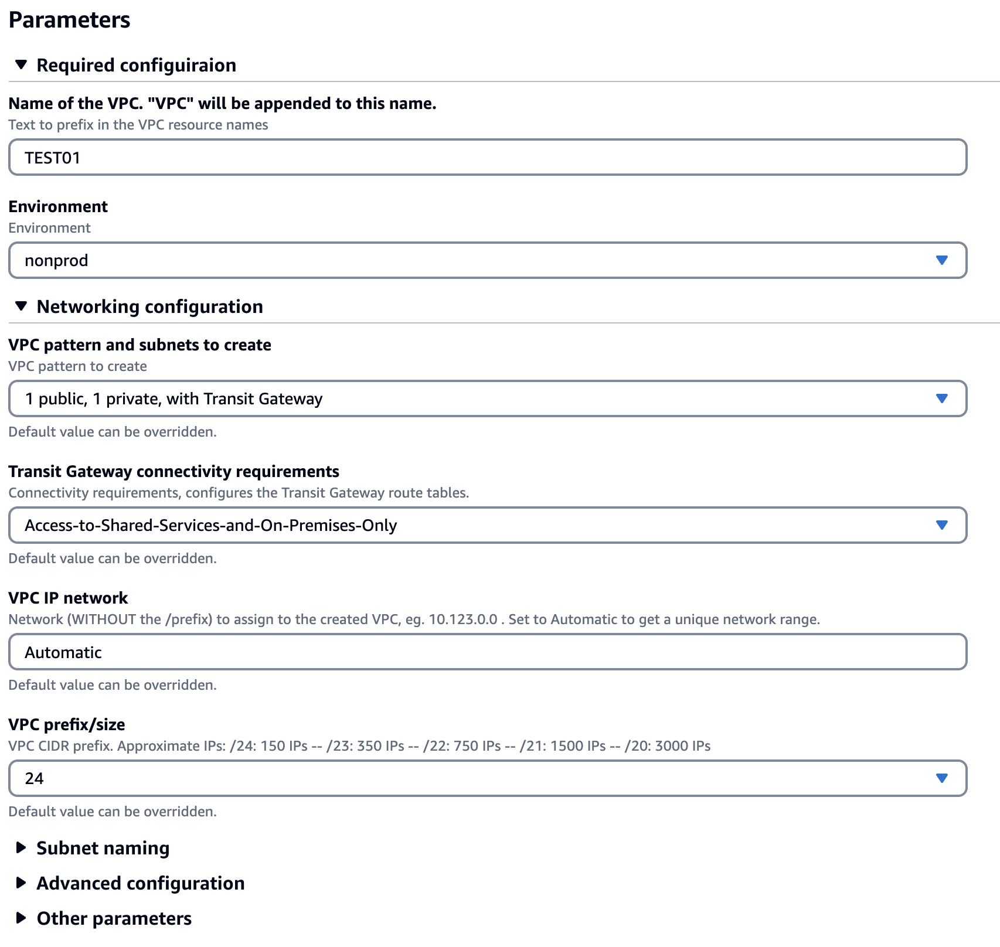
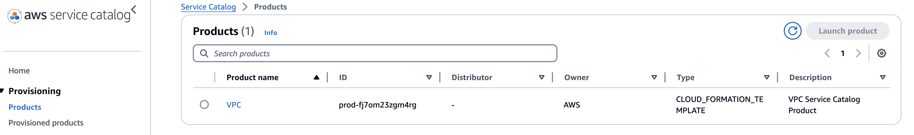
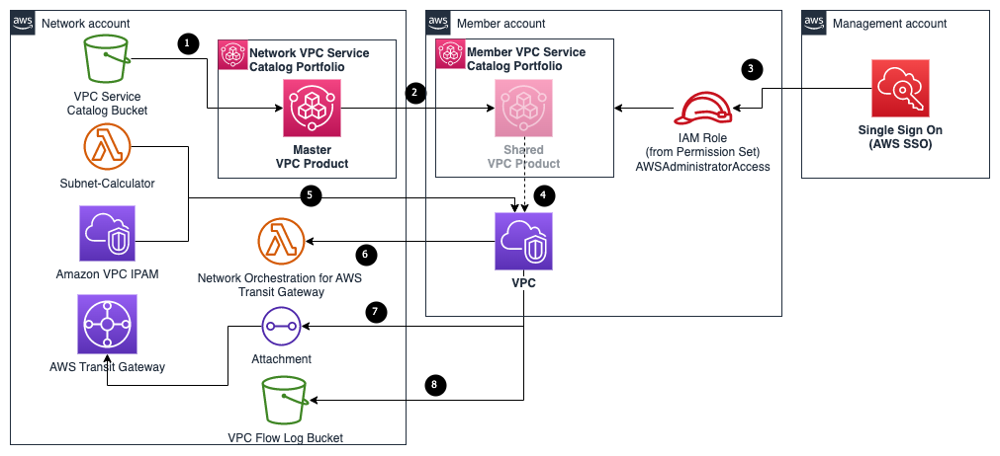
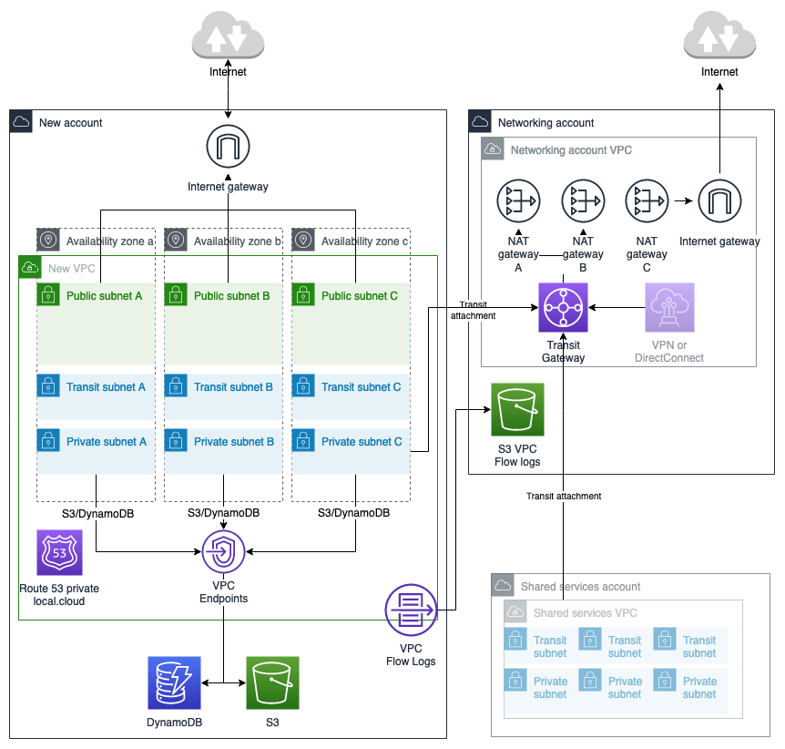

# Unlock Enterprise-Grade VPC Capabilities with Seamless Integrations, Powered by AWS Service Catalog

This is a solution that allows AWS account owners in a multi-account AWS Organizations environment to launch standardized but customizable VPCs using Service Catalog, integrated with Transit Gateway (using [Network Orchestration for AWS Transit Gateway](https://aws.amazon.com/solutions/implementations/network-orchestration-aws-transit-gateway/)), and [Amazon VPC IP Address Manager (IPAM)](https://docs.aws.amazon.com/vpc/latest/ipam/what-it-is-ipam.html). Creating VPCs only require two mandatory field, the Name and Environment:



This makes it **extremely easy** for AWS account administrators/developers to create VPCs, whose CIDRs do not overlap with other VPCs/accounts. It also creates a /28 subnet for the Transit Gateway Attachment as specified in the [TGW best practices guide](https://docs.aws.amazon.com/vpc/latest/tgw/tgw-best-design-practices.html).


The VPC Product for Service Catalog is created on the Network account, and is shared to other accounts by sharing with the Organization, and is automatically imported in a local portfolio created in all accounts (in given OUs) using Customizations for Control Tower (though you can use any automation you prefer). A given AWS SSO permission set is assigned permissions to the Service Catalog portfolio, so that it appears automatically in the Service Catalog Product user view:



High Level architect:



1. An AWS Service Catalog product is created from the VPC CloudFormation template stored in the VPC Service Catalog Bucket.
2. The VPC Service Catalog product is shared with all AWS accounts in your AWS Organization, or on selected OUs, which allows users using designated AWS IAM Identity Center permission sets or IAM roles to request for a standarized VPC.
3. An user assumes an IAM Role via either AWS IAM or IAM Identity Center into the member account, with access to the Service Catalog Portfolio
4. The user launches the VPC Service Catalog product with selected patterns 
5. The VPC stack created from the Service Catalog product connects to AWS VPC IPAM to retrieve an available IP CIDR based on VPC size selected, and send the subnet label and prefix into the Subnet Calculator, which returns the subnet sizes to the CloudFormation stack for Subnet creations.
6. When VPC and Subnets are created, they are tagged based on the VPC and Transit Gateway connectivity pattern selected, which triggers the Network Orchestration for AWS Transit Gateway automation.
7. The Network Orchestration for AWS Transit Gateway automation creates Transit Gateway Attachments and Transit Gateway Route Table Associations and Propagations according to VPC and Subnet Tags.
8. All VPCs created from the Service Catalog product sends VPC Flow Logs into a centralised S3 Bucket.


The network team can update the VPC CloudFormation template stored in git, and update the Service Catalog product through their preferred pipeline. Existing VPCs are not affected by updates, only new VPCs are (or Service Catalog updates to existing VPCs).

There are a number of VPC patterns included in the VPC Service Catalog Product, and they can be customized as needed:
- 1 public, 1 private, with Transit Gateway, dedicated NAT gateways
- 1 public, 1 private, with Transit Gateway
- 1 public, 2 private, with Transit Gateway
- No public, 1 private, with Transit Gateway
- No public, 2 private, with Transit Gateway
- No public, 3 private, with Transit Gateway
- Isolated - No Transit Gateway, multi-AZ NAT, 1 public, 1 private
- Isolated - No Transit Gateway, single-AZ NAT, 1 public, 1 private

Most of the Transit Gateway patterns use centralized NAT gateways in the Network account in an Egress VPC, which not just reduces cost of the VPCs, but also makes it easier to add egress filtering later with a firewall if required. The following is an example of the '1 public, 1 private, with Transit Gateway' pattern:


## Repository Structure

There are four directories in this sample code:

1. `ipam`: Basic sample template to create IPAM pools if you want to quickly test this solution. Modifications in the VPC template may be required to use your existing Amazon VPC IPAM.
2. `service-catalog-product`: AWS Service Catalog components for requesting VPC in a different account
3. `vpc`: CloudFormation template for to create VPCs with different patterns
4. `vpc-flow-log-bucket`: Basic sample template to create a S3 Bucket to store VPC Flow Logs. You can also use your existing logging buckets.

# Installation Steps

## Pre-requisites

- Have administrator access to an AWS Organizations environment.
- Authentication via AWS IAM Identity Center, or alternatively federated with fixed IAM role names in each AWS account.
- Have one or more AWS accounts to deploy the dependancies and consume the Service Catalog product, for example a test account to begin with.

Note: While the solution can be deployed in a single account we recommend deploy across multiple accounts to demonstrate the isolation of roles, responsibilities and end-to-end workflow in an Enterprise environment. If you wish to do so, please see below recommendations:

- A Management Account to setup AWS Organization and create Delegated Administrators for Service Catalog and IPAM.
- A Network Account to deploy [Network Orchestration for AWS Transit Gateway](https://aws.amazon.com/solutions/implementations/network-orchestration-aws-transit-gateway/), [Amazon VPC IP Address Manager (IPAM)](https://docs.aws.amazon.com/vpc/latest/ipam/what-it-is-ipam.html) and [Subnet Calculator](https://github.com/aws-samples/subnet-calculator-custom-resource).
- (Optional) A Shared Services Account to deploy to Service Catalog Product for VPC, this is sometimes deployed in the Network Account as weel.
- A member account to comsume the Service Catalog Product

**The following installation steps assume you are deploying in an AWS Ogranization environment with the above account structure, with Service Catalog product deployed in the Network account.**

### (required) AWS Organization configurations

This step is required if you are deploying this solution into an AWS Account that is not the Organization Management Account.

There are three changes needed on the management AWS account:
- [Resource Access Manager (RAM)](https://aws.amazon.com/ram/) sharing needs to be enabled to share IPAM pools.
- Service Catalog Organizations sharing needs to be enabled, and the account hosting the Service Catalog Product needs to be one of the [delegated administrators for Service Catalog]((https://docs.aws.amazon.com/servicecatalog/latest/adminguide/limits.html)).
- IPAM Organizations sharing needs to be enabled, and the account hosting the IPAM pools need to be the [delegated administrator for IPAM](https://docs.aws.amazon.com/vpc/latest/ipam/enable-integ-ipam.html).

To enable the above, log into the AWS Management (Billing) Account, launch [CloudShell](https://aws.amazon.com/cloudshell/), and run these commands, replacing the account ID of the first line:

```bash
network_account=012345678901  # REPLACE ME
aws ram enable-sharing-with-aws-organization
aws servicecatalog enable-aws-organizations-access
aws organizations enable-aws-service-access --service-principal ds.amazonaws.com
aws organizations register-delegated-administrator --account-id $network_account --service-principal servicecatalog.amazonaws.com # "account-id" will be a the shared services account if you decide to deploy the Service Catalog product in a different account
aws ec2 enable-ipam-organization-admin-account --delegated-admin-account-id $network_account
```
### (dependency - skip if already deployed) Network Orchestration for AWS Transit Gateway

[Network Orchestration for AWS Transit Gateway](https://aws.amazon.com/solutions/implementations/network-orchestration-aws-transit-gateway/) solution automates the process of setting up and managing transit network in distributed AWS enviornments. The automation is achieved by tagging the VPCs. The VPC template in this solution utilises Network Orchestration for AWS Transit Gateway for integration with AWS Transit Gateway.

[Network Orchestration for AWS Transit Gateway](https://aws.amazon.com/solutions/implementations/network-orchestration-aws-transit-gateway/) has many features, but in this step, we will only focus on deploying the basic features to quickly test our solution.

Navigate to [Network Orchestration for AWS Transit Gateway Deployment Guide](https://docs.aws.amazon.com/solutions/latest/network-orchestration-aws-transit-gateway/deploy-the-solution.html), and follow the instructions to deploy the following stacks with parameters:

1. Log into the Management account, click on [“Launch the organization role stack”](https://console.aws.amazon.com/cloudformation/home?region=us-east-1#/stacks/new?stackName=STNO-role&templateURL=https://solutions-reference.s3.amazonaws.com/network-orchestration-for-aws-transit-gateway/latest/network-orchestration-organization-role.template), switch to the desired region, and launch the stack with the following parameters: 
    - **Stack name** - network-orchestration-organization-role
    - **HubAccount** - The account ID for the network account.
2. Log into the Network account, click on [“Launch the hub stack”](https://console.aws.amazon.com/cloudformation/home?region=us-east-1#/stacks/new?stackName=STNO-role&templateURL=https://solutions-reference.s3.amazonaws.com/network-orchestration-for-aws-transit-gateway/latest/network-orchestration-hub.template) , switch to the desired region, and launch the stack with the following parameters:
    - **Stack name** - network-orchestration-hub
    - **Account List or AWS Organizations ARN**: The AWS Organizations ARN
    - **Web User Interface**: No
    - **OrganizationManagementAccountRoleArn**: Role ARN from step 1
    - **(Optional) Do you wish to register the transit gateway with a global network?**: No
    - Leave all other parameters as default
2. Log into the member account, if VPCs have never been attached to a Transit Gateway, a service-linked role for Transit Gateway attachment creation is required. To check if the role already exists, navigate to the IAM console and in Roles (IAM→Roles) search for AWSServiceRoleForVPCTransitGateway. If the role does not exist, click on [“Launch the service-linked-role spoke stack”](https://console.aws.amazon.com/cloudformation/home?region=us-east-1#/stacks/new?stackName=STNO-role&templateURL=https://solutions-reference.s3.amazonaws.com/network-orchestration-for-aws-transit-gateway/latest/network-orchestration-spoke-service-linked-roles.template) with the following parameter:
    - **Stack name** - network-orchestration-service-linked-role
4. In the member account, click on [“Launch the spoke stack(s)”](https://console.aws.amazon.com/cloudformation/home?region=us-east-1#/stacks/new?stackName=STNO-role&templateURL=https://solutions-reference.s3.amazonaws.com/network-orchestration-for-aws-transit-gateway/latest/network-orchestration-spoke.template), switch to the desired region, and launch the stack with the following parameters:
    - **Stack name** - network-orchestration-spoke
    - **Network (Hub) Account**: The account ID for the network account

Note: In an AWS Organisation environment, the deployment of step 3 and 4 can be automated by CloudFormation StackSets via the management account.

### (dependency - skip if already deployed) Subnet Calculator Custom Resource

This is an SNS backed CloudFormation custom resource accessible by all accounts in the AWS Organization, that can take a given VPC CIDR string, and split it to different sized subnets. The solution in this repo uses the Subnet Calculator to calculator the subnet sizes

To deploy the subnet calculator, log into the Network Account, launch [CloudShell](https://aws.amazon.com/cloudshell/), and run these commands:

```bash
git clone https://github.com/aws-samples/subnet-calculator-custom-resource.git
./install.sh
```

### Service Catalog Product
Finally, run an included script that creates the CloudFormation stacks required for the Service Catalog product for sharing the VPC product. The script assumes all components are deployed in the Network Account. To deploy selected components to other accounts, please modify the script accordingly.

IPAM pools are deployed by default to demonstrate integrations, if you wish to integrate with your existing IPAM pools, please modify the VPC product template and the script accordingly.

Log into the Network Account, launch [CloudShell](https://aws.amazon.com/cloudshell/) and run these commands:

```bash
git clone https://gitlab.aws.dev/chengwww/vending-advanced-customizable-vpcs-with-service-catalog/-/tree/main?ref_type=heads
cd service-catalog-product
./install.sh # follow prompts
```

The script will ask for the following information:
- Do you want to use existing VPC Flow Log S3 Bucket or create a default one
- The account ID that you have deployed your subnet calculator into, if its not the network account
- The prod OU ARN you want to share your prod IPAM pool with
- The nonprod OU ARN you want to share you non-prod IPAM pool with
- The Service Catalog “provider” display name, which can be your company or organization name.
- The Service Catalog product version, which defaults to “v1”. Increment this if you make a change in the product CloudFormation template file.
- The Principal type that will be using the Service Catalog product. If you are using AWS IAM Identity Center, enter “IAM_Identity_Center_Permission_Set”. Otherwise, if you have federated IAM roles configured, select “IAM role name”.
- The Principal(s) that will have access to the Service Catalog product across the AWS accounts. If you are using IAM Identity Center, this will be a permission set name, for example “AWSAdministratorAccess”. Otherwise, enter the IAM role name.

The script will create the following CloudFormation stacks:
- ```IPAM.yaml```: creates sample IPAM pools for prod and non-prod workloads, and share with specified OUs
- ```VPC-SC-Bucket.yaml```: creates a S3 bucket that contains the "VPC-Product.yaml" CloudFormation template file associated with the Service Catalog product. When the 
- (optional)```VPC-Flow-Log-Bucket.yaml```: creates a S3 bucket to store VPC Flow Logs for all VPCs created using the Service Catalog Product in the organization
- ```VPC-Service-Catalog.yaml```: creates a Service Catalog Portfolio and Product using the S3 bucket from the previous step and gives permissions to the required principals to launch the product.

After the script finishes the installation, it asks whether it should automatically share this Service Catalog portfolio with the entire AWS Organization, or a specific account, or whether you will configure sharing to specific OUs manually.

To manually configuring sharing with an OU, go to Service Catalog -> Portfolios, select “VPC”, and in the “Share” tab, add a share, and select “AWS Organization”, and select the OU. Make sure you check the "Principal Sharing" checkbox, and click on Share. The product will be shared to all accounts and child OUs within the selected OU.

You can then log into an AWS account that has access to the shared Service Catalog product, ensuring you are logged in with the designated IAM Identity Center Permission Set or IAM role. Launch the product in Service Catalog to request for a VPC with approved patterns.


## Cleanup

To avoid ongoing charges, follow these steps:

- In the test Workload Account(s):
- - Go to Service Catalog Provisioned products, and terminate the associated provisioned product(s). This deletes the VPC and other associted resources, including the Transit Gateway Attachments
- - Go to CloudFormation, and delete the "network-orchestration-spoke-service-linked-roles" stack
- In the Network Account:
- - Go to Service Catalog, Portfolios, click on “VPC”, go to the “Share” tab, and select the items in the list, and click on Actions -> Unshare.
- - Go to CloudFormation, and delete the “VPC-Service-Catalog” stack. 
- - Go to S3, select the bucket starting with “vpc-sc-bucket”, click on “Empty”, and empty the bucket.
- - (if using default VPC flow log bucket) Go to S3, select the bucket starting with “vpc-flow-logs”, click on “Empty”, and empty the bucket.
- - Go to CloudFormation, and delete the following stacks: 1) VPC-SC-Bucket, 2) VPC-Flow-Log-Bucket, 3) IPAM 4) network-orchestration-hub 5) network-orchestration-spoke 6) Subnet-Calculator 7) VPC-Service-Catalog
- In the Management Account:
- - Go to CloudFormation, and delete the “network-orchestration-organization-role” stack

## Security

See [CONTRIBUTING](CONTRIBUTING.md#security-issue-notifications) for more information.

## License

This library is licensed under the MIT-0 License. See the LICENSE file.
